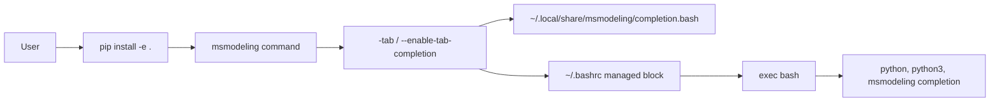

# RFC: msmodeling CLI 静态 Tab 补全

## 元数据

| 项目 | 内容 |
|:---|:---|
| **状态** | Draft |
| **作者** | YinQian |
| **创建日期** | 2026-07-17 |
| **更新日期** | 2026-07-17 |
| **相关链接** | `cli/completion.py`、`cli/main.py`、`pyproject.toml` |

---

## 1. 概述

本 RFC 描述 msmodeling CLI 静态 Tab 补全的实现方案。该功能面向命令行用户，支持为 `python -m cli.inference.*`、脚本路径调用和 `msmodeling` 统一入口提供低延迟参数补全。

补全逻辑采用静态 shell 脚本实现。用户按 Tab 时只执行 shell 内字符串匹配，不启动 Python 进程，也不导入 PyTorch、Transformers、Diffusers 等重型依赖，从而避免补全卡顿或触发运行时副作用。

## 2. 目标

目标：

- 支持 `python`、`python3` 下的常用 msmodeling 命令补全。
- 支持 `python -m cli.inference.<Tab>` 模块名补全。
- 支持 `python -m cli.inference.text_generate ... --<Tab>` 等长选项补全。
- 支持 `msmodeling --enable-tab-completion` 一键启用 Bash 补全，并提供等价短别名 `msmodeling -tab`。
- 支持启用后自动重新进入 Bash，使当前终端和新终端均可使用补全。
- 保持补全逻辑静态、快速、可测试。

## 3. 用例分析

### 3.1 首次启用 Bash 补全

推荐用户在开发环境中先安装 editable entry point，再启用补全：

```bash
cd /path/to/msmodeling
pip install -e .
msmodeling -tab
```

命令执行后：

- 生成静态补全脚本：`~/.local/share/msmodeling/completion.bash`
- 在 `~/.bashrc` 写入受管理的 source 块
- 通过 `exec bash` 重新进入 Bash
- 当前终端和后续新终端均可使用补全

如果不希望执行 `pip install -e .`，也可以通过 `PYTHONPATH` 直接调用模块入口：

```bash
cd /path/to/msmodeling
export PYTHONPATH=/path/to/msmodeling:$PYTHONPATH
python -m cli.main -tab
```

该方式不创建 `msmodeling` shell 命令，只依赖当前仓库源码可被 Python 导入。

### 3.2 日常命令补全

补全启用后，用户仍然使用原有命令形态，不需要改成 `msmodeling inference ...`。

示例：

```bash
python -m cli.inference.text_generate Qwen/Qwen3-32B --num<Tab>
python -m cli.inference.text_generate Qwen/Qwen3-32B --quant<Tab>
python -m cli.inference.te<Tab>
```

上述命令可以补全模块名和长选项，例如 `--num-queries`、`--query-length`、`--quantize-linear-action`、`--compile` 等。

## 4. 方案设计

### 4.1 总体设计

新增 `cli/completion.py`，集中维护静态补全数据和启用逻辑。`cli/main.py` 作为现有 `msmodeling` 统一入口，新增顶层参数并转发到 `cli.completion`。



核心文件：

- `cli/completion.py`：静态补全脚本渲染、Bash rc 管理、补全文件安装。
- `cli/main.py`：新增 `-tab` / `--enable-tab-completion` 入口参数。
- `pyproject.toml`：保留 `msmodeling` 主入口，并新增 `msmodeling-tab`、`msmodeling-completion` 兼容命令。
- `tests/regression/cli/test_completion.py`：验证补全脚本渲染、rc 块写入和幂等性。
- `tests/regression/cli/test_main.py`：验证 `msmodeling` 主入口能正确分发启用逻辑。

### 4.2 静态补全数据

补全表在 `cli/completion.py` 中维护：

- `MODULES`：用于补全 `python -m cli.inference.<Tab>`。
- `TOP_LEVEL_OPTIONS`：用于补全 `msmodeling --<Tab>`。
- `COMMON_OPTIONS`：模型仿真命令共用选项。
- `OPTIONS`：按目标命令划分的长选项列表。

当前覆盖目标：

- `text_generate`
- `video_generate`
- `throughput_optimizer`
- `serving_cast_main`
- `msmodeling` 顶层启用参数

### 4.3 Bash 补全脚本

生成的 Bash 脚本定义 `_msmodeling_complete`，并注册到以下命令：

```bash
complete -o default -F _msmodeling_complete python python3 msmodeling
```

补全函数根据命令行上下文判断目标：

- 当前命令是 `msmodeling`：补全顶层参数、`inference` 子命令及其长选项。
- 当前命令是 `python`/`python3` 且前一个词是 `-m`：补全 `cli.inference.*` 模块名。
- 当前命令包含 `cli.inference.text_generate`、`cli/inference/text_generate.py` 等目标：补全对应长选项。
- 当前词不是 `--*` 时不抢占默认路径补全。

### 4.4 启用流程

启用命令：

```bash
msmodeling --enable-tab-completion
```

等价短命令：

```bash
msmodeling -tab
```

执行行为：

1. 渲染静态 Bash 补全脚本。
2. 写入 `~/.local/share/msmodeling/completion.bash`。
3. 在 `~/.bashrc` 中写入受管理块：

```bash
# >>> msmodeling completion >>>
if [ -r "$HOME/.local/share/msmodeling/completion.bash" ]; then
    . "$HOME/.local/share/msmodeling/completion.bash"
fi
# <<< msmodeling completion <<<
```

4. 执行 `os.execvp("bash", ["bash"])`，用新的 Bash 替换当前进程。

### 4.5 幂等性

`-tab` / `--enable-tab-completion` 可以重复执行：

- 如果 `~/.bashrc` 中已存在管理块，则替换旧块。
- 如果不存在管理块，则追加新块。
- 不会重复追加多个补全块。
- 用户在管理块外的 `.bashrc` 内容保持不变。

## 5. 安全、兼容性与 DFX 设计

安全性：

- 默认 `pip install -e .` 不修改用户 shell 启动文件。
- 只有用户显式执行 `msmodeling -tab` 或 `msmodeling --enable-tab-completion` 才会写入 `~/.bashrc`。
- 写入内容为固定 source 块，不执行动态下载或远程代码。

兼容性：

- 保留原有 `msmodeling = "cli.main:main"` 主入口。
- 新增 `msmodeling-tab` 和 `msmodeling-completion` 兼容入口，用于打印或安装补全脚本。
- 日常业务命令形态不变，仍支持 `python -m cli.inference.text_generate ...`。

可维护性：

- 静态选项表与补全渲染集中在 `cli/completion.py`。
- CLI 参数变化时需要同步更新 `OPTIONS`。
- 后续可考虑从 argparse 自动抽取静态表，但当前阶段避免导入重依赖。

可测试性：

- 测试通过临时 rc 文件和临时补全文件验证，不触碰真实 `~/.bashrc`。
- 渲染结果可直接断言关键字符串。
- 启用逻辑可独立单测。

可靠性：

- 补全时不启动 Python，避免依赖环境不完整时影响 Tab。
- 当前词不是长选项时返回空结果，保留 shell 默认文件路径补全。

## 6. 测试设计

新增测试：

- `tests/regression/cli/test_completion.py`
  - 验证 Bash 补全注册到 `python python3 msmodeling`。
  - 验证补全脚本包含 `cli.inference.text_generate`、`--num-queries`、`--quantize-linear-action` 等关键项。
  - 验证启用命令写入静态补全文件和 rc 管理块。
  - 验证重复启用不会产生重复管理块。

- `tests/regression/cli/test_main.py`
  - 验证 `msmodeling --enable-tab-completion` 转发到 `enable_tab_completion`。
  - 验证 `msmodeling -tab` 转发到 `enable_tab_completion`。

### 6.1 单元测试

执行新增和相关回归测试：

```bash
source /path/to/venv/bin/activate
python -m pytest tests/regression/cli/test_completion.py \
  tests/regression/cli/test_main.py::test_main_enables_tab_completion
```

结果：

```text
4 passed
```

### 6.2 安装模式测试

该方法验证 `pip install -e .` 后，`msmodeling` 命令已安装，同时用内部 helper 验证补全文件与 rc 管理块写入逻辑。由于正式入口会执行 `exec bash`，自动化测试中不直接运行 `msmodeling -tab`，避免测试进程被新的 Bash 替换。

```bash
source /path/to/venv/bin/activate
cd /path/to/msmodeling
UV_CACHE_DIR="$HOME/.cache/uv" uv pip install -e . --no-deps

tmp_home="$(mktemp -d)"
command -v msmodeling
HOME="$tmp_home" python - <<'PY'
from cli.completion import enable_tab_completion

raise SystemExit(enable_tab_completion(reload_shell=False))
PY
```

验证点：

- `msmodeling` entry point 可调用。
- 临时 `.bashrc` 包含受管理补全块。
- 临时 `~/.local/share/msmodeling/completion.bash` 存在。
- 补全脚本包含 `complete -o default -F _msmodeling_complete python python3 msmodeling`。

可使用以下命令做断言：

```bash
test -f "$tmp_home/.bashrc"
test -f "$tmp_home/.local/share/msmodeling/completion.bash"
grep -q "# >>> msmodeling completion >>>" "$tmp_home/.bashrc"
grep -q "complete -o default -F _msmodeling_complete python python3 msmodeling" \
    "$tmp_home/.local/share/msmodeling/completion.bash"
```

### 6.3 免安装模式测试

该方法不执行 `pip install -e .`，通过 `PYTHONPATH` 让 Python 找到当前仓库源码，再用内部 helper 验证补全文件与 rc 管理块写入逻辑。正式使用时仍调用 `python -m cli.main -tab`。

```bash
source /path/to/venv/bin/activate
cd /path/to/msmodeling
export PYTHONPATH=/path/to/msmodeling:$PYTHONPATH

tmp_home="$(mktemp -d)"
HOME="$tmp_home" python - <<'PY'
from cli.completion import enable_tab_completion

raise SystemExit(enable_tab_completion(reload_shell=False))
PY
```

验证点：

- 无需 `msmodeling` entry point。
- `python -m cli.main` 可调用启用逻辑。
- 临时 `.bashrc` 包含受管理补全块。
- 临时补全脚本包含 `python`、`python3` 和 `msmodeling` 的补全注册。

可使用以下命令做断言：

```bash
test -f "$tmp_home/.bashrc"
test -f "$tmp_home/.local/share/msmodeling/completion.bash"
grep -q "# >>> msmodeling completion >>>" "$tmp_home/.bashrc"
grep -q "complete -o default -F _msmodeling_complete python python3 msmodeling" \
    "$tmp_home/.local/share/msmodeling/completion.bash"
```

## 7. 风险与限制

### 7.1 当前终端立即生效方式

Bash 补全函数必须加载到当前 shell 进程中。`msmodeling -tab` 无法把函数直接注入已经打开的父 shell，因此启用逻辑在写入 `~/.bashrc` 后执行 `exec bash`，用新的 Bash 替换当前进程并读取最新配置。

效果：

- 当前终端在命令返回后已经进入新的 Bash，可直接使用补全。
- 新终端也会通过 `~/.bashrc` 自动加载补全。
- 启用命令必须放在命令链最后，因为 `exec bash` 后不会继续执行后续命令。

### 7.2 静态表维护成本

CLI 参数新增或删除后，需要同步维护 `cli/completion.py` 中的 `OPTIONS`。

缓解方式：

- 新增/修改 argparse 参数时同步更新补全表。
- 回归测试断言关键参数存在。
- 后续可评估在构建时生成静态表，而不是 Tab 时动态导入。

### 7.3 Shell 覆盖范围

当前 `-tab` / `--enable-tab-completion` 只支持 Bash 自动写入。

缓解方式：

- 保留 `msmodeling-tab print --shell zsh` 和 `msmodeling-tab print --shell powershell` 输出能力。
- 后续可单独扩展 Zsh/PowerShell profile 自动写入。

## 8. 后续优化

- 从 argparse 自动生成静态补全表，并在测试中校验静态表与实际参数一致。
- 为参数值增加静态补全，例如量化枚举值、`--log-level`、`--remote-source`。
- 支持 Zsh profile 自动启用。
- 支持 PowerShell profile 自动启用。
- 在 README 或用户指南中增加 Tab 补全使用说明。

---

## 附录

### 常用命令

安装后启用：

```bash
cd /path/to/msmodeling
pip install -e .
msmodeling -tab
```

免安装启用：

```bash
cd /path/to/msmodeling
export PYTHONPATH=/path/to/msmodeling:$PYTHONPATH
python -m cli.main -tab
```

### 示例补全

```bash
python -m cli.inference.te<Tab>
python -m cli.inference.text_generate Qwen/Qwen3-32B --num<Tab>
python -m cli.inference.text_generate Qwen/Qwen3-32B --quant<Tab>
msmodeling --enable<Tab>
```
