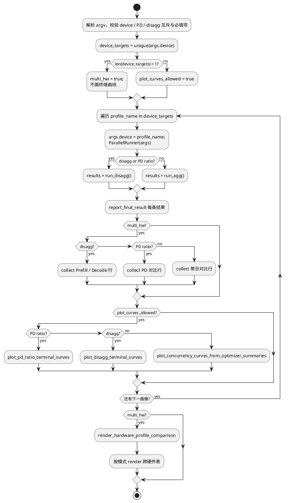
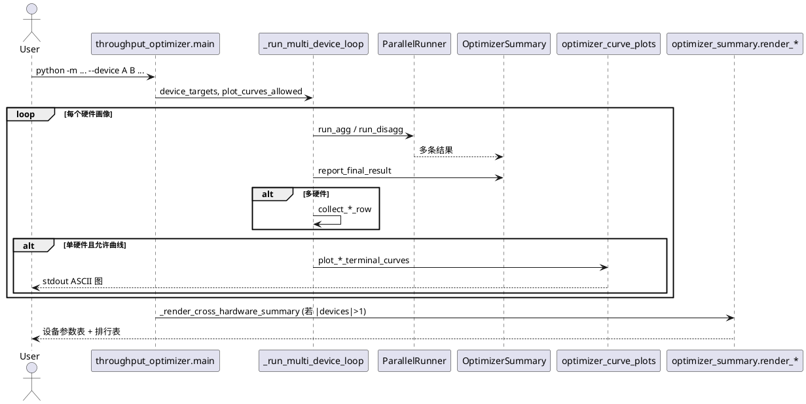
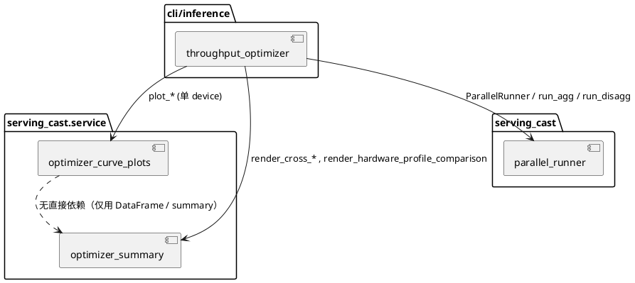
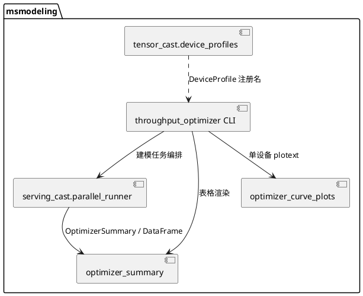

# 特性设计：吞吐寻优多硬件展示与终端 ASCII Plot

## 修订记录

| 日期 | 修订版本 | 修改描述 | 作者 | RFC 文档 |
| -- | -- | -- | -- | -- |
| 2026-05-09 | 1.0 | 初稿：多 `--device` 对比、`plotext` 曲线、拆解/PD 比例路径说明 | — | 本文档 |

---

## 功能描述

### 背景与问题

`throughput_optimizer` CLI 在单机建模视角下对给定序列长度与 SLO（TTFT/TPOT 等）搜索最优并行与并发配置。实际选型时常需在 **多种 DeviceProfile** 间对比「同等约束下谁更优」，且单硬件深入分析时需要 **可视化吞吐–并发–时延** 关系。此前若仅支持逐设备打印明细、缺少结构化跨硬件汇总或终端曲线，使用者难以在一次命令中完成对比与曲线复盘。

### 核心价值与目标

（1）**多 `--device`**：单次调用传入多个已注册硬件画像名，按画像顺序依次完整寻优；在 **多于一块画像** 时，于全部运行结束后输出 **设备抽象参数对照表** 与 **模式相关的跨硬件排行表**。  
（2）**终端 ASCII Plot**：在 **仅单一 `--device`** 时，寻优结束后自动（在满足依赖时）用 **plotext** 在终端绘制两组 ASCII 曲线：**纵轴为吞吐（聚合/拆解 token/s）或 P/D QPS（PD 比例模式）**，横轴分别为 **并发** 与 **TPOT 或 TTFT（按模式）**。  
（3）**模式一致**：聚合（默认）、拆解（`--disagg`）、PD 比例寻优（`--enable-optimize-prefill-decode-ratio`）在多硬件路径下的 **表格展示分支** 与单硬件路径下的 **曲线绘制分支** 语义对齐，避免使用者混淆。

对用户而言：多硬件一次跑完即可得到可排序的对比表；单硬件一次跑完可在终端直接看到曲线趋势（无需额外子命令）。对维护者而言：展示逻辑集中在 `optimizer_summary`（表格）与 `optimizer_curve_plots`（曲线），CLI 层只做编排。

---

## 实现思路

### 总体架构

- **入口**：`cli/inference/throughput_optimizer.py` 的 `main()` 解析参数 → 校验 `--device` → 计算 `plot_curves_allowed` → 调用 `_run_multi_device_loop()` → 调用 `_render_cross_hardware_summary()`。
- **逐设备执行**：`_run_multi_device_loop` 对每个 `profile_name` 临时改写 `args.device` 为该画像，构造 `ParallelRunner`；根据是否拆解或 PD 比例调用 `run_agg()` 或 `run_disagg()`；对每个 `OptimizerSummary` 调用 `report_final_result`；若 **多硬件** 则从结果中 **采集一行对比摘要** 写入对应列表（聚合 / PD / Prefill / Decode）。
- **曲线**：仅当 `plot_curves_allowed` 为真（见下文谓词）时，在该设备循环迭代内调用 `serving_cast.service.optimizer_curve_plots` 中对应入口，向 stdout 打印 plotext 画布。
- **跨硬件表格**：仅当 `len(device_targets) > 1` 时，`_render_cross_hardware_summary` 打印 `render_hardware_profile_comparison`，再按 CLI 模式打印 `render_cross_device_comparison`、`render_cross_hardware_pd_ratio` 或 Prefill/Decode 两张拆解表。

### 关键谓词与分支

| 谓词 | 含义 |
|------|------|
| `multi_hw = len(device_targets) > 1` | 采集跨硬件行并在收尾打印对比表 |
| `plot_curves_allowed = len(device_targets) == 1` | 允许打印终端 ASCII 曲线（与拆解、PD 比例兼容；多硬件时不画曲线，避免刷屏与语义混杂） |

曲线侧分流（单设备时）：

- **PD 比例**：对首个非空 `get_summary_df()` 调用 `plot_pd_ratio_terminal_curves`（含 Prefill 侧 QPS–并发–TTFT 与 Decode 侧 QPS–并发–TPOT 两组图，纵轴标签分别为 P/D QPS）。
- **拆解**：`plot_disagg_terminal_curves`，按各 `OptimizerSummary.data_config` 区分 Prefill（`ttft_limits` 有、`tpot_limits` 无）与 Decode（反之），分别准备数据并各 emit 一组双图。
- **聚合**：`plot_concurrency_curves_from_optimizer_summaries`，合并多 runner 的 summary DataFrame 后画 **token/s vs 并发** 与 **token/s vs TPOT**。

数据准备要点（`optimizer_curve_plots.py`）：

- 聚合与 Decode：`_prepare_curve_df`，按 TTFT/TPOT 限制与内存可用列过滤；若存在 `ttft` 列且 **至少有一个非空**，才应用 TTFT SLA，避免 Decode 全 NaN 误杀。
- Prefill：保留 `ttft` 作为第二张图的横轴；源表即使同时带有无用 `tpot` 列，也不会参与 Prefill 曲线排序，避免重复列标签或语义混淆。

### 逻辑流程图

### 时序图

### 代码结构设计（逻辑分组）

---

## 接口设计

### CLI（使用者）

| 参数 / 模式 | 说明 |
|-------------|------|
| `--device DEVICE [DEVICE ...]` | 一个或多个已注册 `DeviceProfile` 名；多画像时顺序执行并在末尾输出跨硬件表；**仅单画像时** 才可能输出终端 ASCII 曲线。 |
| `--disagg` | 拆解寻优；与 `--enable-optimize-prefill-decode-ratio` **互斥**。多硬件时采集 Prefill/Decode 两行并分别打印跨硬件表。 |
| `--enable-optimize-prefill-decode-ratio` | PD 比例网格寻优；需同时配置 `--prefill-devices-per-instance` 与 `--decode-devices-per-instance`。多硬件时按 **balanced QPS** 排序打印 PD 对比表。 |
| `--ttft-limits` / `--tpot-limits`（及既有 SLO 相关项） | 既影响寻优过滤，也影响曲线 DataFrame 过滤（见 `_prepare_*`）。 |

### 内部关键接口（维护者）

| 符号 | 说明 |
|------|------|
| `_run_multi_device_loop(..., plot_curves_allowed)` | 多硬件循环、采集对比行、触发曲线。 |
| `_render_cross_hardware_summary(args, device_targets, rows)` | `len(device_targets)<=1` 时直接返回；否则打印画像摘要 + 模式对应跨硬件表。 |
| `render_hardware_profile_comparison(device_names)` | 有效 GEMM、内存带宽、容量、通信网格形状对照。 |
| `render_cross_device_comparison(rows)` | 聚合：按 `throughput_tps` 排序。 |
| `render_cross_hardware_pd_ratio(rows)` | PD：按 `balanced_qps` 排序。 |
| `render_cross_hardware_disagg_prefill / _decode(rows)` | 拆解两阶段分别排序展示。 |
| `plot_concurrency_curves_from_optimizer_summaries` | 聚合终端曲线。 |
| `plot_disagg_terminal_curves` | 拆解 Prefill（第二轴 TTFT）与 Decode（第二轴 TPOT）。 |
| `plot_pd_ratio_terminal_curves` | PD：Prefill 侧 **P QPS**；Decode 侧 **D QPS**。 |

### 依赖与降级

| 依赖 | 行为 |
|------|------|
| **plotext**（可选） | 未安装时记录 warning，跳过终端曲线，不影响寻优与表格。 |
| **torch**（画像表） | `render_hardware_profile_comparison` 在 ImportError 时跳过并 warning。 |

---

## 模块与周边关系

约束：终端 plotext 使用模块级画布，**不适合并发交错调用**；当前 CLI 为顺序单线程调用，满足约定。

---

## DFX 能力设计

### 安全性

无新增网络监听或任意代码执行；输出仅为 stdout 表格与 ASCII 图。多硬件对比数据来自本地建模结果。

### 可靠性

曲线绘制异常单独捕获并记录 `Terminal ASCII optimizer curves failed`，不中断主流程（具体以当前实现为准：emit 层 try/except 记录日志）。Prefill 路径直接使用 `ttft` 作为横轴，避免把 `ttft` 临时改名为 `tpot` 后产生重复列名。

### 可用性 / 性能

多硬件为 **顺序** 执行画像，总耗时随画像数近似线性增长；终端曲线只在单硬件启用，避免一次性输出过多大图。

### 可测试性

| 方向 | 说明 |
|------|------|
| 单元测试 | `serving_cast/tests/ut/test_service/test_optimizer_curve_plots.py`：聚合曲线入口、列缺失、SLA 过滤、OOM 过滤、Prefill 双列防护等。 |
| CLI / 集成 | 可对 `_run_multi_device_loop` / `main` 做 mock runner 测分支；或使用极小网格手工跑一次多 `--device` 验收表格与单 `--device` 验收曲线（需安装 plotext）。 |

### 安全设计及安全 checklist（摘要）

| Checklist 内容 | 检查结果 |
|----------------|----------|
| 新增对外网络接口 | N |
| 新增任意文件写（曲线） | N（仅 stdout） |
| 可选第三方绘图库 plotext | Y（pip 常规依赖，使用者可控安装） |

---

## 使用说明

1. **多硬件对比**：`--device ProfA ProfB ProfC`，无需额外开关；收尾可见「设备 profile 摘要」与对应模式下的跨硬件排行表。  
2. **终端曲线**：仅保留 **一个** `--device`；确保环境已安装 **plotext**。拆解与 PD 比例模式下同样会在单设备时出图。  
3. **模式互斥**：`--enable-optimize-prefill-decode-ratio` 与 `--disagg` 不可同时使用（CLI 会报错退出）。  
4. **空表或无曲线**：跨硬件行依赖各次寻优是否产出有效「最佳配置」；若全部被过滤可能打印 warning。曲线在过滤后无行、缺少必需列、或未安装 plotext 时可能跳过。

---

## 测试设计

| 类型 | 覆盖点 |
|------|--------|
| UT | `optimizer_curve_plots`：有效 DataFrame 触发 emit（mock）、缺列跳过、TTFT 过滤致空、内存过滤、同表含 `ttft`+`tpot` 的 Prefill 预处理。 |
| IT / 手工 | 单 `--device` + 安装 plotext：聚合 / `--disagg` / PD 比例各跑一次，确认两组 ASCII 图与日志无异常。 |
| IT / 手工 | 双 `--device`：确认出现跨硬件表且无终端曲线（或曲线块不出现）。 |

---

## 特性规格与限制

- **曲线粒度**：每个终端图固定宽度/高度（模块内常量 `_TERMINAL_PLOT_COLS` / `_TERMINAL_PLOT_ROWS`），适合快速肉眼对比，非出版级图表。  
- **多硬件不画曲线**：设计取舍；若未来需要可为每画像落地独立 PNG/HTML，需另设特性。  
- **数据列契约**：PD 比例曲线依赖 summary DataFrame 中存在 `parallel_p/concurrency_p/p_qps/ttft_p` 与 `parallel_d/concurrency_d/d_qps/tpot_d` 等列（与寻优输出 schema 一致）。

---

## 兼容性声明

- CLI 对外参数保持既有语义；多 `--device` 与单设备曲线的组合规则为 **行为约定**（单设备才 plot），建议在 README 或用户文档中与 `--help` 同步说明。  
- 未安装 plotext 时行为与旧版「跳过绘图」一致。

---

## 拓展性

- 可增加 `--no-terminal-plots` 显式关闭曲线而不改单/多设备判定。  
- 可将曲线后端抽象为 plotext / matplotlib 文件输出双实现。  
- 跨硬件表可增加 CSV/JSON artifact 导出便于流水线归档。
